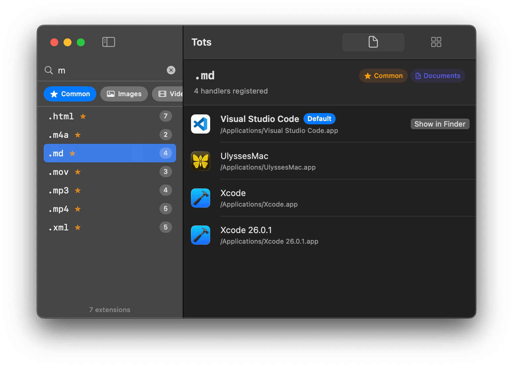
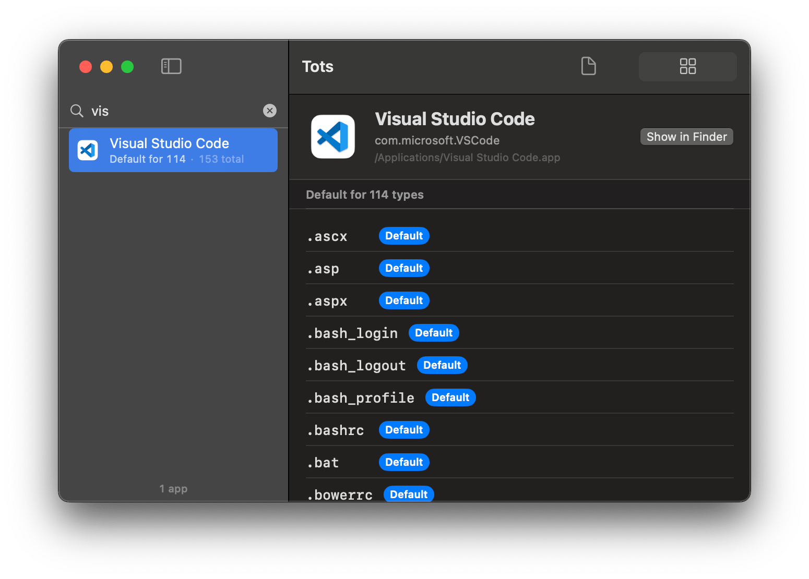

# Tots

<p align="center">
  
</p>

A macOS app for managing file extensions and the apps that handle them, including updating the default handler for an extension.

Tots scans `/Applications`, `/System/Applications`, and `~/Applications` for installed apps and their declared document types. Supports browsing by extension or by app.

<p>
  
  
</p>

## Develop

Requires macOS 14+, Swift 6, and [strudel](https://github.com/octavore/strudel) for building/signing/packaging.

```sh
strudel run               # builds and runs the app
strudel build --install   # builds and installs to /Applications
strudel clean
swift format --in-place --recursive Sources/
```

## Credits

<a href="https://www.flaticon.com/free-icons/bagel" title="bagel icons">Bagel icon created by Freepik - Flaticon</a>

## License

MIT